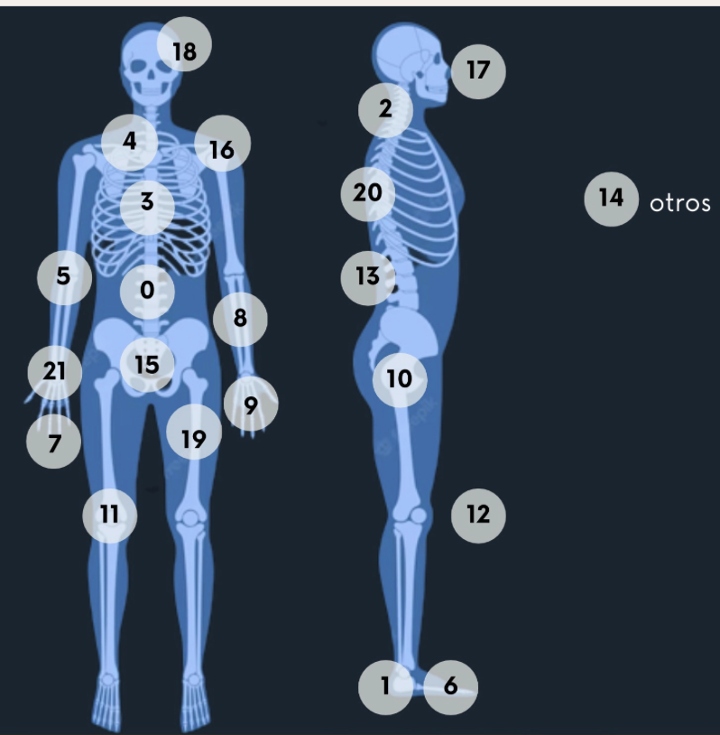
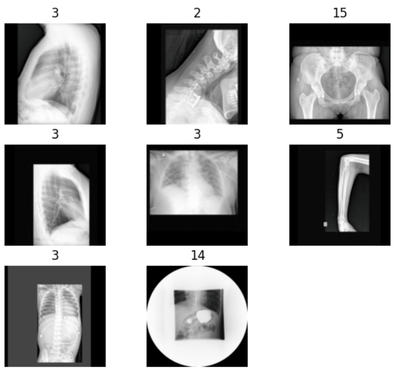
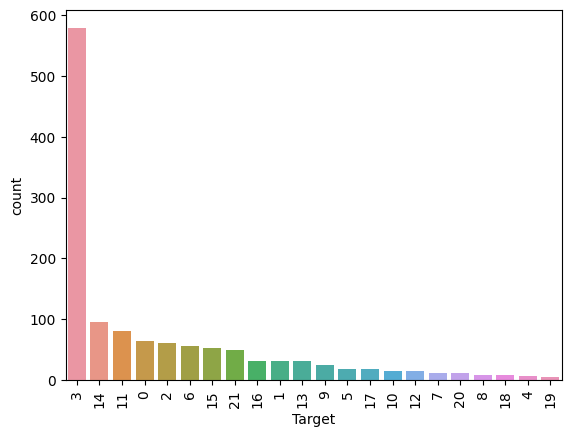
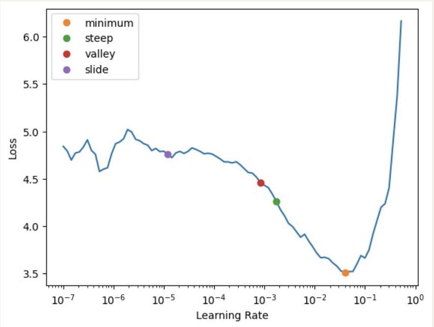
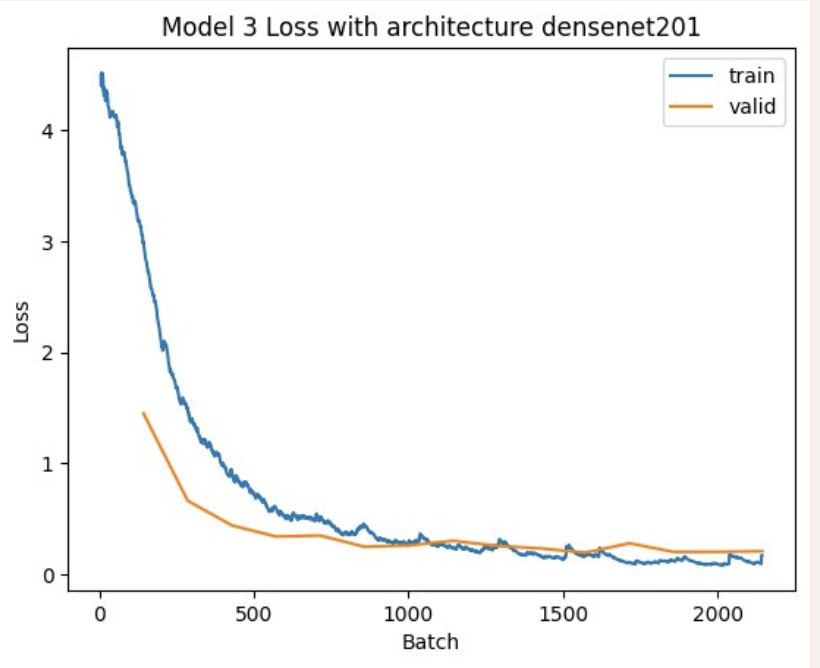
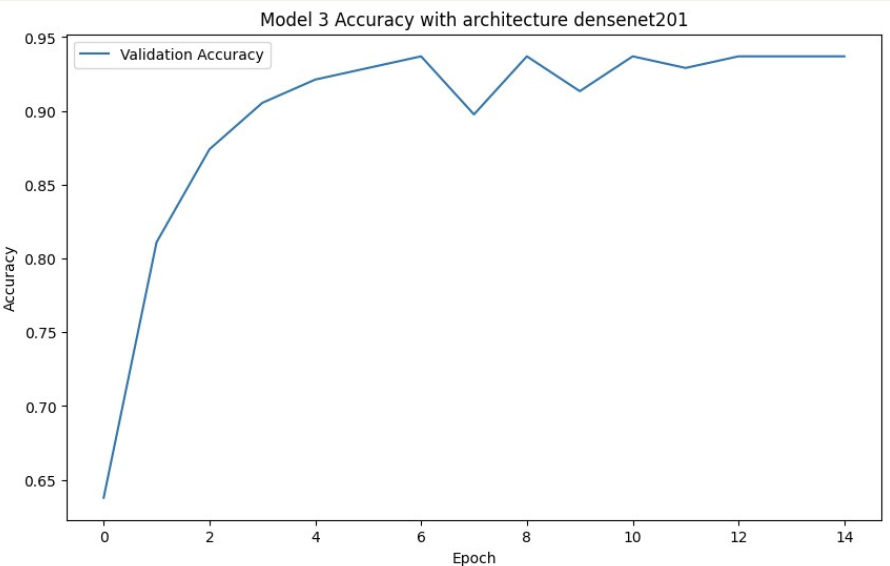
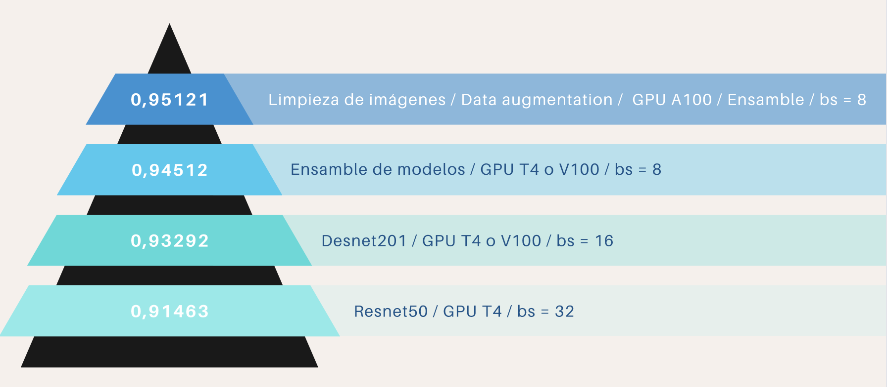

# DATAPROJECT4

En este caso el reto consiste en que afrontéis una competición Kaggle donde vosotros pelearéis por la nota más alta. En este caso vamos a decidir que vuestra capacidad técnica sea la que os evalúe de una manera completamente objetiva.

De cara a realizar este reto, debéis descargaros el dataset que hay adjunto y realizar la predicción de las imágenes catalogadas dentro del dataset de test.

Estos archivos son imágenes radiológicas por lo que vuestro trabajo será entrenar un modelo predictivo capaz de determinar qué parte del cuerpo ha sido radiografiada. Clasificar una parte del cuerpo a partir de una imagen de rayos X puede parecer algo trivial, pero tenerlo automatizado puede ser clave para todo el sector del aprendizaje profundo en imágenes médicas. En muchos hospitales, cuando un médico solicita múltiples adquisiciones de imágenes, se crea un número de acceso para cada parte del cuerpo (p. ej., rodilla, tobillo y pierna), pero el registro de las imágenes correspondientes suele ser incorrecto dentro de cada número de acceso.

El registro incorrecto de partes del cuerpo en radiografías es un problema relevante, ya que si, por ejemplo, se desea extraer un dataset de rodilla utilizando el filtrado de PACS (base de datos donde se almacenan las imágenes medicas en un hospital) mediante la descripción del estudio, a menudo se extraerán imágenes con varias partes del cuerpo. Además, si se crea un modelo para clasificar enfermedades en alguna parte del cuerpo específica, la implementación del modelo en la práctica clínica será casi imposible. Por un lado, imagina que se crea un modelo para detectar neumonía en radiografías de tórax. Para implementar ese modelo, debemos asegurarnos de obtener solo radiografías de tórax. De lo contrario, podemos terminar tratando de diagnosticar una neumonía a partir de una radiografía de cráneo, lo que no tiene ningún sentido.

Recursos útiles

- Pydicom - A extremely useful library in Python that helps you handle DICOM format files. - https://pydicom.github.io/
  
- DICOM - The DICOM website can have multiple information on DICOM metadata and how it can affect the display of an image(eg. PhotometricInterpretation TAG) - https://www.dicomstandard.org/

## Dataset Description

### ¿Qué archivos necesito?

Necesitarás descargar una copia de las imágenes. Encontrarás dos directorios (train y test) que contienen archivos DICOM anonimizados.

También necesitarás las etiquetas de entrenamiento de train.csv y los nombres de los archivos del conjunto de test de sample_submission.csv.

### ¿Cuál es el formato de los datos?

Los datos de entrenamiento se proporcionan como un conjunto de SOPInstanceUIDs y sus etiquetas en csv. Las etiquetas se definen como una columna Target que contiene enteros que se asignan a diferentes partes del cuerpo.

### Imágenes DICOM

Todas las imágenes proporcionadas están en formato DICOM.

### ¿Qué estoy prediciendo?

En este desafío, los competidores deben predecir la parte del cuerpo a partir de una radiografía.

Debe haber una columna de predicción por imagen, y las etiquetas se representan como números enteros que corresponden cada uno a una parte del cuerpo contenida en el conjunto de datos:

- Abdomen = 0

- Tobillo = 1

- Columna cervical = 2

- Tórax = 3

- Clavículas = 4

- Codo = 5

- Pies = 6

- Dedos = 7

- Antebrazo = 8

- Mano = 9

- Cadera = 10

- Rodilla = 11

- Pierna = 12

- Columna lumbar = 13

- Otros = 14

- Pelvis = 15

- Hombro = 16

- Senos paranasales = 17

- Cráneo = 18

- Muslo = 19

- Columna torácica = 20

- Muñeca = 21

Nota - Otros indica si la muestra contiene imágenes no radiográficas que a veces se colocan erróneamente en el sistema PACS como radiografías (por ejemplo, esofagograma, densitometría).

### Archivos

train.csv - el conjunto de entrenamiento. Contiene el SOPInstanceUID y la información del objetivo.

sample_submission.csv - un archivo de presentación de muestras en el formato correcto. Contiene SOPInstanceUID para el conjunto de test.

### Columnas

SOPInstanceUID - Cada SOPInstanceUID corresponde a una imagen única.

Target - La etiqueta asignada a cada muestra.

## Preparación del entorno de trabajo

Para poder realizar este proyecto, es necesario ejecutar el .ipynb en un entorno de trabajo que disponga de una GPU sufiencientemente potente para poder entrenar el modelo. En este caso, se ha utilizado Google Colab, que es un entorno de trabajo gratuito que nos permite ejecutar el .ipynb en la nube, con una GPU de forma gratuita. También se puede optar por usar Colab Pro, que es de pago, pero que nos permite usar una GPU más potente y durante más tiempo.

## Conversion archivos DCIM a JPG

Para poder trabajar con las imágenes, es necesario convertir los archivos DCIM a JPG. Para ello, se ha utilizado la librería pydicom, que nos permite leer los archivos DCIM y convertirlos a JPG. Además, y como se puede ver en el notebook [DP4.ipynb](DP4.ipynb), se ha reducido el tamaño a una anchura de 512 manteniendo la relación de aspecto. También, se organizan las imagenes en diferentes carpetas en función de la parte del cuerpo que se está radiografiando.

Algunos ejemplos de las imágenes que se obtienen son:

## Entrenamiento del modelo

Para entrenar el modelo, se ha utilizado la librería fastai, que nos permite entrenar modelos de forma sencilla. En este caso, se ha utilizado un modelo de transferencia de aprendizaje, que nos permite utilizar un modelo ya entrenado y adaptarlo a nuestro problema. En este caso, la estrategia que mejor resultado ha dado ha sido la de hacer un ensemble de los modelos densenet169, densenet201 y densenet161, ya que cada uno de ellos, al tener una profundidad de capas ocultas diferentes, es capaz de centrarse en diferentes niveles de detalle de las imágenes a entrar. Además, al incluir la conexión del residuio de cada capa convulucional entre sí, se evita el problema del desvanecimiento del gradiente, haciendo posible entrenar redes neuronales muy profundas.

También se han usado técnicas de data augmentation ya que, como se puede ver en el siguiente gráfico, existe un gran desbalance entre la clase 3 y el resto de clases. 

### Learning rate

Para encontrar el learning rate óptimo, se ha utilizado la función lr_find() de fastai, que nos permite encontrar el learning rate óptimo para entrenar el modelo. A continuación se muestra la imagen con los 4 learning rates que nos devuelve la función:

De entre los 4 learning rates, se ha elegido el valley, ya que es el que nos devuelve un compromiso entre la velocidad de aprendizaje y la estabilidad del modelo durante el entrenamiento.

### Entrenamiento

Durante las 15 epochs (con batch size = 8) en las que se entrena el modelo, se calcula el train loss y el validation loss. En el siguiente gráfico se puede ver la evolución de ambos para uno de los 3 modelos utilizados en el ensemble:

### Resultados

Tras entrenar el modelo, se obtiene la siguiente gráfica con los resultados obtenidos en el conjunto de validación:

En la siguiente imagen, se resumen los resultados obtenidos para accuracy con todas las pruebas que se han efectuado en este DP:

